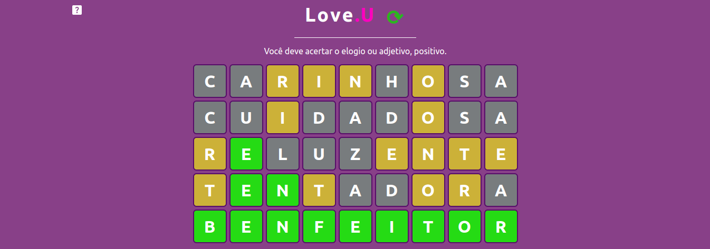

<h1 align="center">Love.UUU</h1>

 

## :pushpin: Sumário
  1. [Descrição do Projeto](#descrição)
  2. [Técnicas e Tecnologias](#tecnologias)
  3. [Abrir e executar o projeto](#executar_o_projeto)
  4. [Features do Projeto](#project_features)
  4. [Pessoas que ajudaram a desenvolver o projecto](#developers)
  5. [English Readme](./READMEEnglish.md)

### :tada: Descrição do Projeto 
###### descrição
Tem uma pessoa muito importante na minha vida e agora estou mais distante dela (ela mudou de estado) e a gente sempre joga term.ooo então resolvi fazer um clone do jogo onde só vai ter elogios; O objetivo do jogo é fazer o usuário adivinhar uma palavra em até 5 tentativas. Enquanto a resposta certa não é dada, o jogador precisa arriscar elogios ao invés de dar palpites de letras. A cada sugestão, o jogador recebe dicas do quanto está próximo da resposta correta. Se uma letra ficar amarela, significa que ela está presente, mas em outra posição. Já se ficar verde, ela está no local exato. Por fim, se aparecer a cor cinza escuro, indica que ela não está presente na palavra.
### :technologist: Técnicas e Tecnologias
###### tecnologias
- React.js
- Javascript 
- Node.js
- Styled Components
- MUI 
- NPM
## 🛠️ Abrir e executar o projeto
###### executar_o_projeto
#### 1- Clone o Projeto
#### 2- Digite no CMD para instalar todas as dependências
  `npm install`
#### 3- Digite no CMD para iniciar o react-app
  ` npm start `
### :hammer: Features do Projeto
###### project_features
- `Escrever pelo teclado`: O jogo aceita digitação pelo teclado para manter user-friendly, mas possui o teclado virtual para quando eu for passar para mobile;
- `Mais de uma palavra por dia`: Diferente do jogo Termo/Wordle você pode jogar mais de uma vez apenas clicando no botão de "recarregar";
- `Não sei jogar`: Não tem problema, no canto superior esquerdo existe um botão que possui um manual explicando o jogo;
## :busts_in_silhouette: Desenvolvedora do projeto
###### developers
| [ Carolina Teixeira Coelho](https://github.com/caroolt) | 
| :---: |

